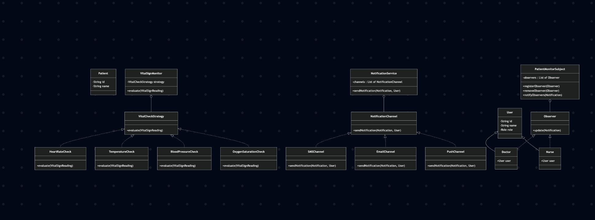

# Patient Monitoring and Notification System

This project is a Java-based patient monitoring system that demonstrates key software design principles and patterns. It's designed to monitor patients' vital signs, detect anomalies, and send notifications to healthcare professionals through various channels.

## Core Concepts

The system is built around the following core concepts:

*   **Patient Monitoring:** The system continuously monitors vital signs of patients, such as heart rate, blood pressure, oxygen saturation, and temperature.
*   **Anomaly Detection:** It uses a set of rules to detect abnormal vital sign readings.
*   **Notification System:** When an anomaly is detected, the system sends notifications to relevant healthcare staff (doctors, nurses) through multiple channels like SMS, Email, and Push notifications.
*   **User Roles:** The system defines different user roles (Doctor, Nurse) with different responsibilities.
*   **Extensibility:** The system is designed to be easily extensible with new vital sign checks, notification channels, and user roles.

## UML Diagram

```mermaid
classDiagram
    class User {
        -String id
        -String name
        -Role role
    }

    class Doctor {
        +User user
    }

    class Nurse {
        +User user
    }

    class Patient {
        -String id
        -String name
    }

    class VitalSignMonitor {
        -VitalCheckStrategy strategy
        +evaluate(VitalSignReading)
    }

    class VitalCheckStrategy {
        +evaluate(VitalSignReading)
    }

    class HeartRateCheck {
        +evaluate(VitalSignReading)
    }

    class TemperatureCheck {
        +evaluate(VitalSignReading)
    }
    
    class BloodPressureCheck {
        +evaluate(VitalSignReading)
    }
    
    class OxygenSaturationCheck {
        +evaluate(VitalSignReading)
    }

    class NotificationService {
        -channels : List of NotificationChannel
        +sendNotification(Notification, User)
    }

    class NotificationChannel {
        +sendNotification(Notification, User)
    }

    class SMSChannel {
        +sendNotification(Notification, User)
    }

    class EmailChannel {
        +sendNotification(Notification, User)
    }
    
    class PushChannel {
        +sendNotification(Notification, User)
    }

    class PatientMonitorSubject {
        -observers : List of Observer
        +registerObserver(Observer)
        +removeObserver(Observer)
        +notifyObservers(Notification)
    }

    class Observer {
        +update(Notification)
    }

    User <|-- Doctor
    User <|-- Nurse
    
    VitalSignMonitor o-- VitalCheckStrategy
    VitalCheckStrategy <|.. HeartRateCheck
    VitalCheckStrategy <|.. TemperatureCheck
    VitalCheckStrategy <|.. BloodPressureCheck
    VitalCheckStrategy <|.. OxygenSaturationCheck

    NotificationService o-- NotificationChannel
    NotificationChannel <|.. SMSChannel
    NotificationChannel <|.. EmailChannel
    NotificationChannel <|.. PushChannel

    PatientMonitorSubject o-- Observer
    Observer <|.. Doctor
    Observer <|.. Nurse
```




## Design Principles and Patterns

This project adheres to the following SOLID principles and employs several design patterns:

### SOLID Principles

*   **Single Responsibility Principle (SRP):** Each class has a single, well-defined responsibility. For example, the `VitalSignMonitor` is responsible for checking vital signs, while the `NotificationService` is responsible for sending notifications.
*   **Open/Closed Principle (OCP):** The system is open for extension but closed for modification. You can add new vital sign checks or notification channels without modifying the existing code, thanks to the Strategy and Factory patterns.
*   **Liskov Substitution Principle (LSP):** Subtypes are substitutable for their base types. For example, `Doctor` and `Nurse` are subtypes of `User` and can be used wherever a `User` is expected.
*   **Interface Segregation Principle (ISP):** The project uses several small, focused interfaces (e.g., `NotificationChannel`, `VitalCheckStrategy`, `Observer`) rather than large, monolithic ones.
*   **Dependency Inversion Principle (DIP):** High-level modules do not depend on low-level modules; both depend on abstractions. For example, `VitalSignMonitor` depends on the `VitalCheckStrategy` interface, not on concrete implementations like `HeartRateCheck`.

### Design Patterns

*   **Strategy Pattern:** Used to define a family of algorithms (vital sign checks) and make them interchangeable. The `VitalCheckStrategy` interface and its implementations (`HeartRateCheck`, `BloodPressureCheck`, etc.) are a good example.
*   **Factory Pattern:** Used to create objects without exposing the creation logic to the client. The `NotificationChannelFactory`, `NotificationFactory`, and `VitalCheckStrategyFactory` classes are examples of this pattern.
*   **Observer Pattern:** Used to establish a one-to-many dependency between objects. The `PatientMonitorSubject` (the subject) notifies all its registered `Observer`s (the observers) when a patient's vital signs are abnormal.
*   **Static Factory Pattern:** The `VitalCheckStrategyFactory` uses static initialization to provide a single shared map of strategies. This avoids redundant object creation and offers global access without requiring an instance. 

## Project Structure

This modular layout ensures clean separation of concerns and makes the system easier to navigate and extend. The project is organized into the following packages:

*   `demo`: Contains a demonstration of the notification system.
*   `enums`: Contains enumerations for `Role`, `SeverityLevel`, and `VitalType`.
*   `exceptions`: Contains custom exception classes.
*   `factory`: Contains factory classes for creating objects.
*   `manager`: Contains the `NotificationService` for managing notifications.
*   `model`: Contains the data models for the system (e.g., `User`, `Patient`, `Notification`).
*   `observer`: Contains the classes for the Observer design pattern.
*   `strategy`: Contains the classes for the Strategy design pattern, organized into `channel` and `vital` sub-packages.
*   `util`: Contains utility classes like `AuditLogger` and `IdGenerator`.

## Setup and Usage

### Prerequisites

*   Java Development Kit (JDK) 24 or higher
*   Apache Maven

### Building the Project

1.  Clone the repository:
    ```bash
    git clone https://github.com/your-username/notification-system.git
    ```
2.  Navigate to the project directory:
    ```bash
    cd notification-system
    ```
3.  Build the project using Maven:
    ```bash
    mvn clean install
    ```

### Running the Demo

To run the demo application, execute the following command:

```bash
mvn exec:java -Dexec.mainClass="com.notificationsystem.Main"
```

This will run the `NotificationDemo` which simulates a scenario where a patient's vital signs are monitored, and notifications are sent to a doctor and a nurse.

## How to Extend the System

### Adding a New Vital Sign Check

1.  Create a new class that implements the `VitalCheckStrategy` interface.
2.  Implement the `evaluate` method with the logic for the new vital sign check.
3.  Add the new vital sign to the `VitalType` enum.
4.  Update the `VitalCheckStrategyFactory` to include the new strategy.

### Adding a New Notification Channel

1.  Create a new class that implements the `NotificationChannel` interface.
2.  Implement the `sendNotification` method with the logic for the new channel.
3.  Update the `NotificationChannelFactory` to include the new channel.
4.  Register the new channel with the `NotificationService` in the demo or your application logic.