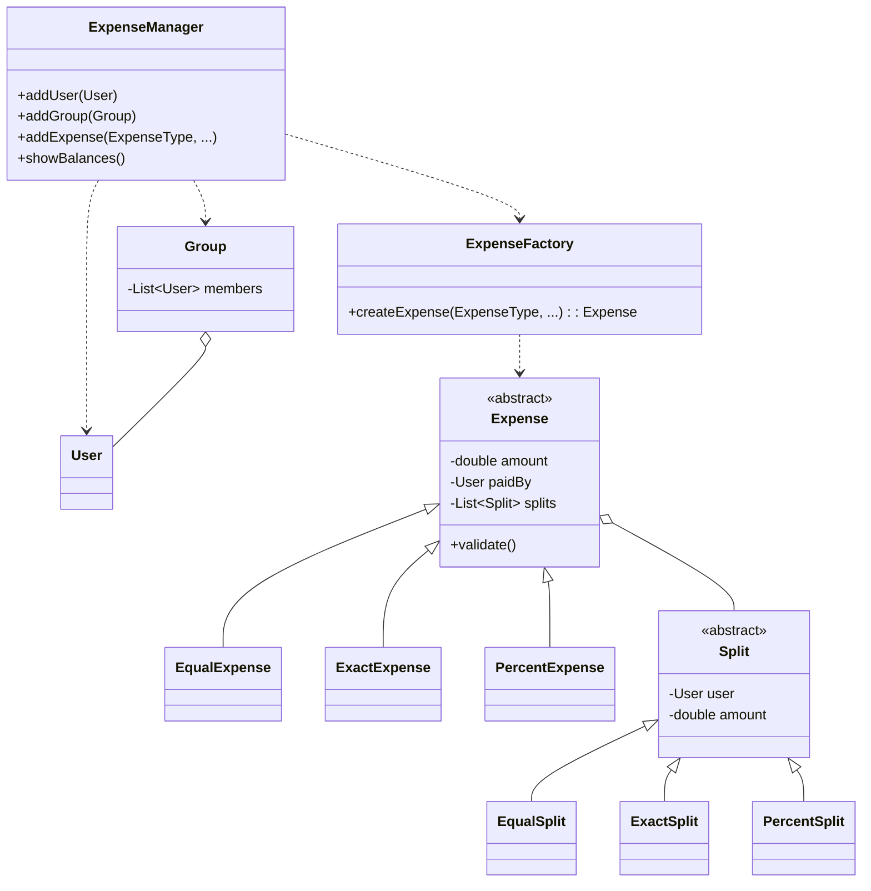

# 💸 Splitwise - Expense Sharing Application

This project is a command-line simulation of an expense-sharing application like Splitwise. It provides a clear, simplified model for managing users, groups, and shared expenses. It's an excellent case study for applying object-oriented design principles and patterns to solve a real-world logic puzzle.

---

## ✨ Core Concepts

The application is built around a few core concepts that model the expense sharing process:

*   👤 **User:** An individual who can participate in expenses. Each user has a unique ID and contact information.
*   👥 **Group:** A collection of users who share expenses. All expenses are recorded within a group context.
*   💰 **Expense:** The central entity representing a single transaction. It defines who paid, how much, and how the cost is split. This is an abstract concept with three concrete splitting methods:
    *   `EqualExpense`: The cost is divided equally among all participants.
    *   `ExactExpense`: Each participant pays a specific, pre-defined amount.
    *   `PercentExpense`: Each participant pays a certain percentage of the total.
*   📊 **Split:** Represents a single user's share of an expense. This is also an abstract class with concrete types (`EqualSplit`, `ExactSplit`, `PercentSplit`) that correspond to the expense type.
*   🕹️ **ExpenseManager:** The main controller of the system. It manages users, groups, and the final balance sheet, providing the core logic for adding expenses and calculating who owes whom.

---

## 🎨 Design & Architecture

<details>
<summary>Click to view UML Diagram</summary>



</details>

### SOLID Principles

The design adheres to the SOLID principles to create a system that is robust and easy to maintain.

| Principle                               | Description                                                                                                                                                                                                                          |
| --------------------------------------- | ------------------------------------------------------------------------------------------------------------------------------------------------------------------------------------------------------------------------------------ |
| 🎯 **Single Responsibility (SRP)**      | Each class has a single purpose. `User` and `Group` are data models. `ExpenseFactory` only creates expenses. `ExpenseManager` orchestrates the main operations.                                                                     |
| 🔌 **Open/Closed (OCP)**                | The system is **open for extension, but closed for modification**. We can add a new expense type (e.g., `ByShareExpense`) by creating new `Expense` and `Split` subclasses and updating the `ExpenseFactory`, without touching `ExpenseManager`. |
| ↔️ **Liskov Substitution (LSP)**         | Subtypes can replace their base types. The `ExpenseManager` works with the abstract `Expense` class and can handle `EqualExpense`, `ExactExpense`, etc., polymorphically without knowing the specific type. Each expense type correctly implements its own `validate()` method. |

### Design Patterns

| Pattern                               | Usage                                                                                                                                                                                                                                                                                        |
| ------------------------------------- | -------------------------------------------------------------------------------------------------------------------------------------------------------------------------------------------------------------------------------------------------------------------------------------------- |
| 🏭 **Factory Pattern**                | Used to create objects without exposing the creation logic. The `ExpenseManager` delegates the creation of `Expense` objects to an `ExpenseFactory`. This decouples the manager from concrete expense classes, upholding the Open/Closed Principle.                                                |
| 🚗 **Strategy Pattern**               | The various expense types (`EqualExpense`, `ExactExpense`, `PercentExpense`) act as **strategies** for splitting a cost. The `ExpenseManager` and `ExpenseFactory` work together to select the appropriate strategy at runtime based on user input, without the client needing to know the implementation details of how each split is calculated or validated. |

---

## 🛠️ Setup and Usage

This project is built using Apache Maven. You can build and run it from the command line.

### Prerequisites

*   Java Development Kit (JDK) 8 or higher
*   Apache Maven

### Build and Run

1.  **Navigate to the project directory**:

    ```sh
    cd projects/splitwise
    ```

2.  **Build the project** using Maven:

    ```sh
    mvn clean install
    ```

3.  **Run the application** to see the demo:

    ```sh
    mvn exec:java -Dexec.mainClass="com.splitwise.Main"
    ```

    This will execute the demo, which creates users, adds various types of expenses, and prints the final balances, showcasing the application's functionality.